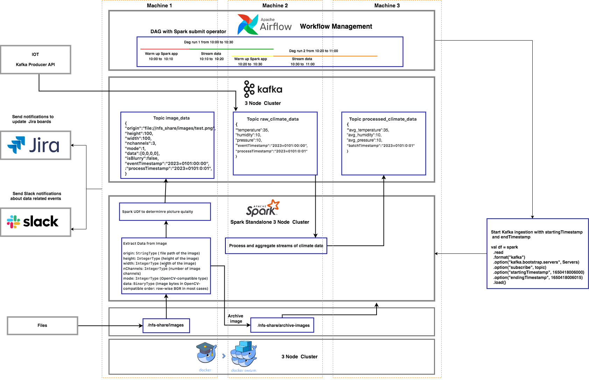

# Data Processing System

The Data processing solution allows one to deploy and process data on multiple nodes on the Edge closer to the data.
Ideal for first level of data cleansing, filtering and real time analytics.It can also be adapted to work on large datasets on cloud or on-prem.
 
 
## Architecture




The architecture consists of the following:
* An Apache Spark cluster to process data as Batch processing or event driven Streaming applications.
* An Apache Kafka cluster  to store amd process events as messages
* An Apache Airflow cluster to schedule and monitor the appications
* A Docker Swarm cluster for container orchestration

## Running the POC

```
git clone https://github.com/BooleanComputing/data_processing_system.git
cd data_processing_on_edge
./deploy-architecture.sh
```
This starts a single node swarm cluster andd deploys the services.

## Accessing the services

#### Apache Spark
```
   spark standalone Master: spark://<host>:7077
   spark history server UI: http://<host>:5000
   spark connect server UI: http://<host>:4040
   spark Connect Server: sc://<host>:15002
   ```
 * Test the spark connect server for interactive development and ad-hoc analytics with Spark from an IDE or Notebook.
    * replace  localhost with node IP/hostname and run `application/spark_connect_demo.py` 
#### Apache Kafka
   ```
     kafka broker: <service name>:9092
     kafka UI: <httttp://host:5001
   ```
* Kafka Broker is only accessible from within the swarm network

* Information about the broker, Topics and messages can be accessed through the kafka UI

#### Apache Airflow
   
   ```
   airflow ui: htttp://<host>:8080
   default user=admin
   default password=admin
   ``` 
* The implementation has a couple of Dags that demonstrate reading, processing and writing the events to and from kafka
* Weather-Streaming DAG schedules a Spark structured streaming apppication that reads IOT data from a kafka topic, averagaes out the Temperature, Humidity andd Pressure on 10 second windows and writes the output to another Kafka topic.
* Generate-Weather-Test-Data DAG runs a python application to generate  mock climate sensor data and write to the kafka topic for testing
 
 Trigger the Test DAG from the UI
 
 
 Check the messages in the Topics from the Kafka UI
 


## Decomissioning

`./delete-architecture.sh`
 
  Cleans and resets the environment to the starting point.


### Disclaimer
This System is developed using Open Source software.It comes without any warranty or guarantees. You can redistribute it
and/or modify it under the terms of the respective software licenses.

### Contact
Looking for some collaboration in building a custom solution for you data processing needs? Ready to deploy solutions from Boolean UG help you easily bootstrap,customize and manage data processing systems at scale.

Message me at : https://www.linkedin.com/in/vasista-polali-a2954b20/
 